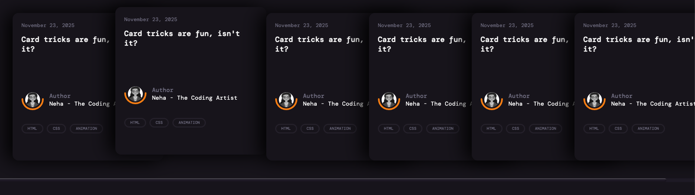

# Animated Card

A sleek and responsive **animated card list** built with **HTML, CSS, and modern CSS variables**. This project showcases a horizontal card slider with hover effects, theme support (light/dark), and RTL (Right-to-Left) layout compatibility.

---

## Features

- **Responsive card list**: Horizontally scrollable cards with smooth snap alignment.
- **Hover animations**: Cards lift up on hover and push neighboring cards aside.
- **Light & Dark mode**: Easily switch between themes using `data-theme` attribute.
- **RTL support**: Fully compatible with right-to-left layouts.
- **Custom scrollbar**: Styled scrollbar for a better UX.
- **Gradient text effects**: Hovering on card titles or tags triggers a vibrant gradient effect.
- **CSS Variables**: Easily customizable colors, shadows, and typography.

---

## Demo

  
_Replace `screenshot.png` with your actual demo screenshot._

---

## Installation

1. Clone this repository:

```bash
git clone https://github.com/najmunnaharneha/animated-card.git
```

2. Open `index.html` in your browser.

---

## Usage

Set the theme via the HTML `data-theme` attribute:

```html
<!-- Light Mode -->
<html data-theme="light">
  <!-- Dark Mode -->
  <html data-theme="dark"></html>
</html>
```

RTL direction is handled using the `dir` attribute:

```html
<html dir="rtl"></html>
```

---

## Customization

You can customize colors, fonts, and shadows by editing CSS variables in `card.css`:

```css
:root {
  --body-bg: #ffffff;
  --body-color: #333;
  --card-bg: #fff;
  --tag-border: #dcdcdc;
  --shadow-color: rgba(0, 0, 0, 0.1);
  --text-color: #000;

  --color1: #ff8a00;
  --color2: #e52e71;
}
```

---

## Technologies

- HTML5
- CSS3 (Flexbox, CSS Variables, Grid)
- Google Fonts (DM Mono)
- No JavaScript dependencies required (optional JS for theme check)

---

## License

This project is **open source** and available under the [MIT License](LICENSE).

---

## Author

**Neha - The Coding Artist**  
[GitHub](https://github.com/najmunnaharneha) | [Codepen](https://codepen.io/neha-thecodingartist)
